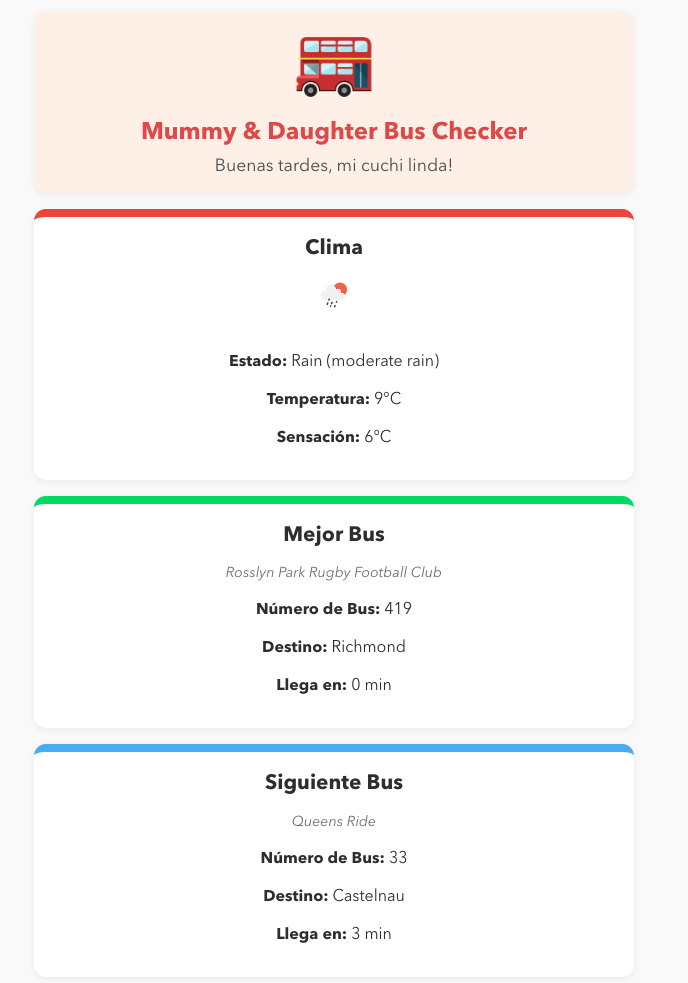

# Mummy & Daughter Bus Checker

A **mobile-friendly** web app to see which bus is best to catch near your preferred bus stops.

This exaple is designed for quick, real-time updates on two bus stops so my wife can get to the correct bus stop at time in the morning to drop off our daughter at nursery.



## Features

- **Flask Backend** calling TFL’s API and OpenWeatherMap API to retrieve arrivals for two bus stops and weather data.
- **React Frontend** that highlights the best bus (soonest arrival).
- **Responsive Design** for iPhones and small screens.
- **Deployed to AWS Lambda + API Gateway** for a serverless, scalable solution.

## Tech Stack

- **Python + Flask** (backend)
- **React** (frontend)
- **Zappa** for serverless deployment on AWS
- **TFL StopPoint API** for real-time arrival info
- **OpenWeatherMap API** for real-time weather data
## Local Setup

1. **Clone** this repo.
2. **Backend**:
   ```bash
   cd backend
   python -m venv venv
   source venv/bin/activate  # or venv\Scripts\activate on Windows
   pip install -r requirements.txt
   python app.py
   ```
   The Flask server runs on http://127.0.0.1:5000

3. **Frontend**:
    ```bash
    cd ../frontend
    npm install
    npm start
    ```
    The React app runs on http://localhost:3000
    Make sure the fetch URL in App.js is http://127.0.0.1:5000/api/bus-info if running locally


