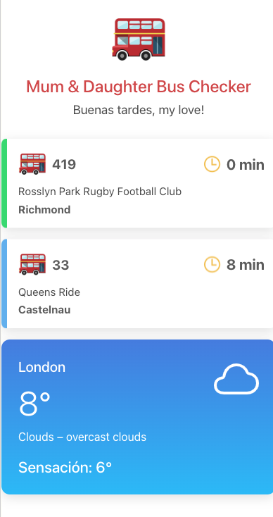

# Mum & Daughter Bus Checker 

A **mobile-friendly** web app for my wife to see which bus is best to catch near our home in London to take our daughter to nursery, combining real-time updates with weather data.

  

## Features

- **Flask Backend**: calling TFL’s API and OpenWeatherMap API to retrieve arrivals times and weather data.
- **React Frontend**: highlights the best bus (soonest arrival).
- **Responsive Design**: for iPhones and small screens.
- **Deployed to AWS Lambda + API Gateway**: for a serverless, scalable solution.

## Demo

- **Test it out!** [here](https://d5u2us17egi17.cloudfront.net/)

